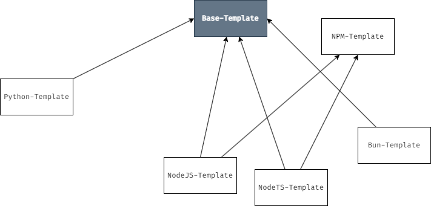

# Template Tree System Guideline
This file is found in repositories that are part of a Template Tree SYStem as described in [Better Solution Building using a Template Tree](https://symplectic.link/Better+Solution+Building+using+a+Template+Tree).

The dependencies of this flow are, 
1. [Github CLI](https://github.com/cli/cli)
2. [Git CLI](https://git-scm.com/)
3. [Github CLI Extension - gh-template](https://github.com/heaths/gh-template)

The following will list all the commands necessary for working within this framework. The maintenance and usage is done manually, until a proper tool is developed for the purpose.

Before anything, you need to create a github organization to contain all of your templates. In my case, I have named it, `Development-Templates-Directory`. 

To develop our templates, we choose to store them at, `~/.local/templates/` (Linux) or `~\AppData\Local\Templates`. Make sure these directories are created. 

Create a directory with the same name as the organization. This folder will contain all of the templates.

Create the `Base-Template` repo, which will serve as the root node for all templates.

```bash
# within the template organization directory

gh repo create Development-Templates-Directory/Base-Template --public --disable-wiki --license MIT --clone && gh repo edit Development-Templates-Directory/Base-Template --template
```

1. To create a new template from a base one, 
```bash
# within the template organization directory

gh repo create Development-Templates-Directory/<New-Template> --public --clone --template Development-Templates-Directory/<Base-Template> && gh repo edit Development-Templates-Directory/<New-Template> --template
```
2. To received updates from the base template,
```bash
# within the template organization directory

cd <New-Template> && git remote add template https://github.com/Development-Templates-Directory/<Base-Template>.git
```
*Note: Many remotes can be added if we wish to build a composite template. The main remote has always the name `template`. The additional ones follow the format, `template-xxxxx`. To remove a remote, `git remote remove template[-xxxxx]`*

3. To sync the new template with its remotes,
```bash
# within the new template directory

git fetch --all && git merge template/main --allow-unrelated-histories -m "Syncing with $(git remote get-url origin | sed -E 's|.*github.com[:/](.*)\.git|\1|') on $(date +%s)."
```
4. To use the template, 
```bash
# from anywhere

gh template clone <Project-Name> --template Development-Templates-Directory/<Some-Template> --public
```

# Template Tree View



# Author
Abderraouf Belalia<<abderraoufbelalia@symplectic.link>>